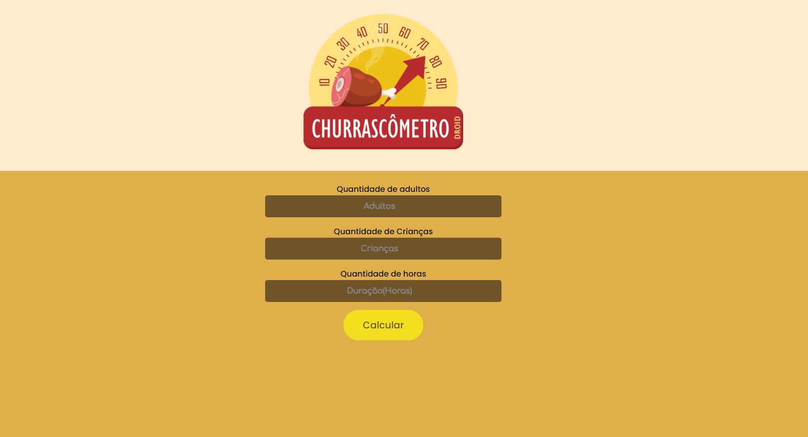
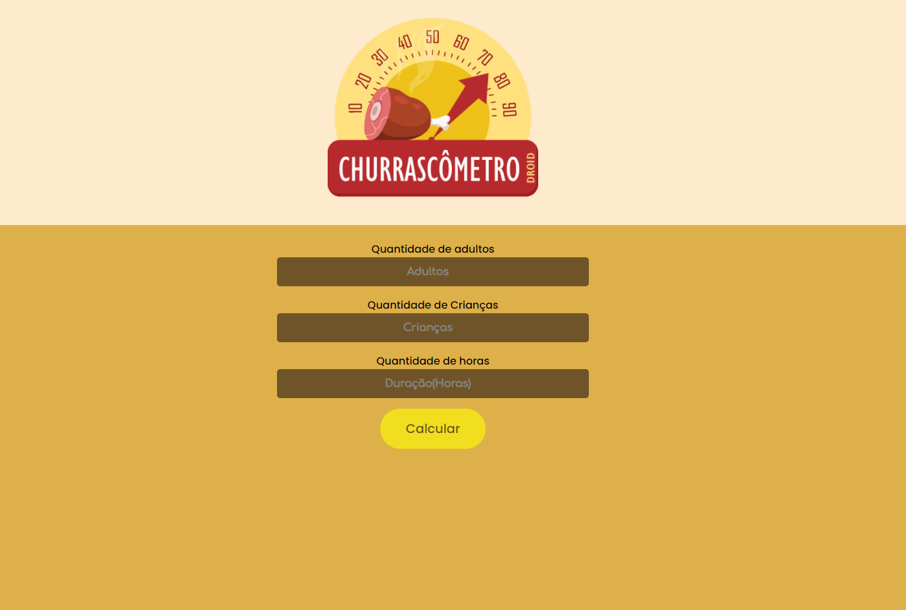
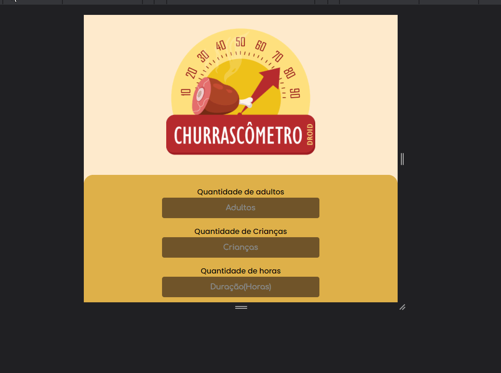

<h1 align="center" style="font-size: 2.5rem">
    Projeto Churrascômetro
</h1>

        Projeto do curso onde foi pedido para fazer um projeto que fizesse o calculo da quantidade de carne, cerveja e bebidas precisaria no churrasco de acordo com os dados inseridos pelo usuário.      

O calculo foi feito em cima das seguintes informações:

- Carne: 400gr por pessoa + de 6horas - 650 
-  Cerveja: 1200ml por Pessoa + 6 horas - 2000ml 
- Refrigerante/água: 1000ml por pessoa + 6 horas 1500ml 
- Crianças valem por 0,5

Teste o projeto: https://wendsant.github.io/Churrascometro/

Imagens do projeto:

    
    

        Funcionamento do projeto:
    

    
    

        Responsividade:
    

    
 

 

## 💻 Tecnologias
 Este Projeto foi feito utilizando as seguintes tecnologias:

 - ✔️ HTML5
 - ✔️ CSS3
 - ✔️ JavaScript
